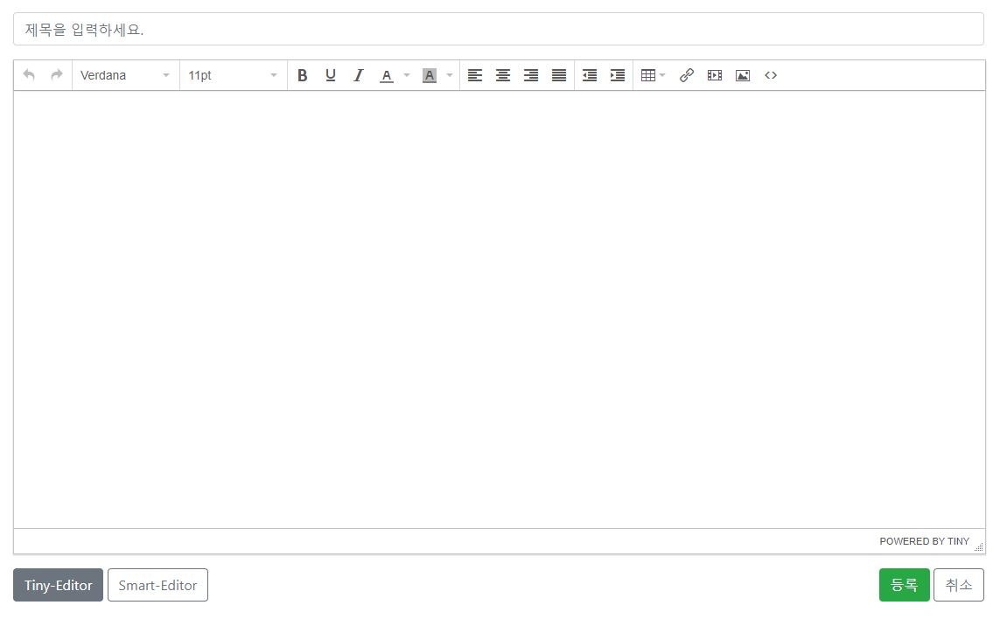
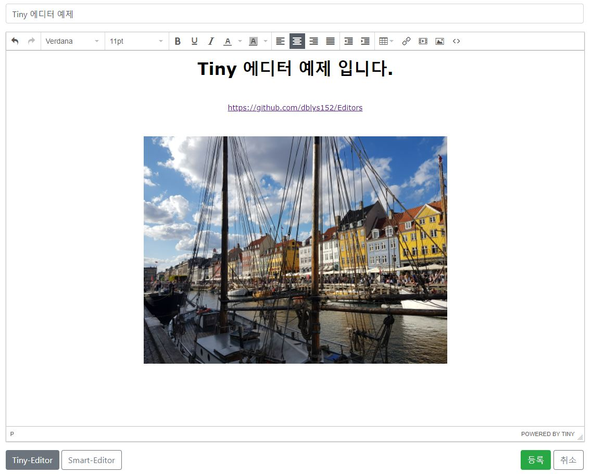
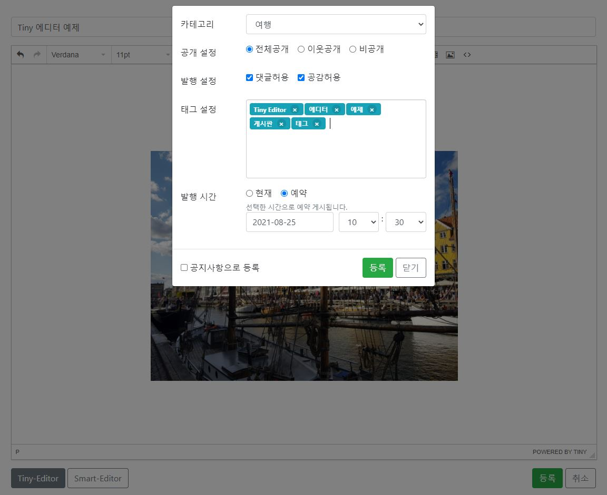
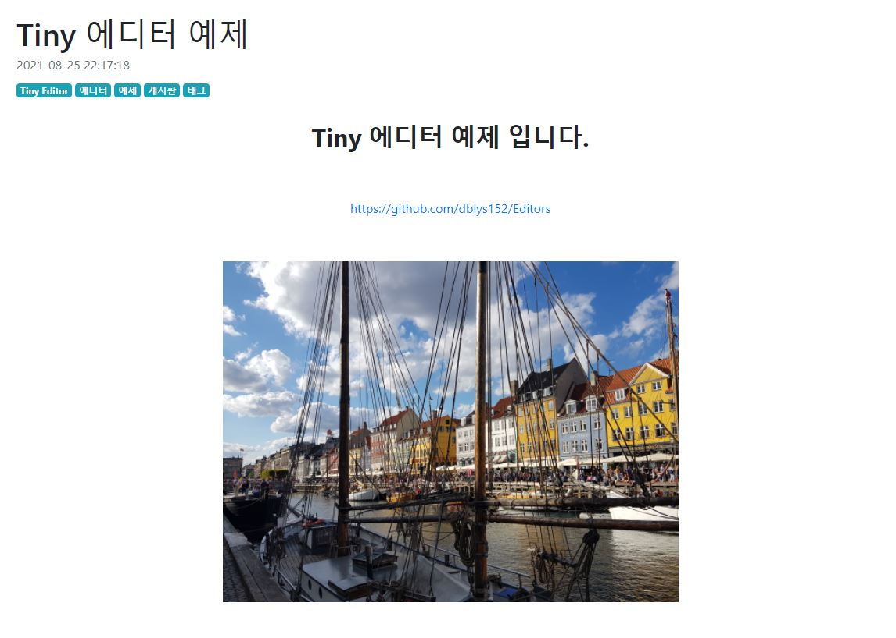
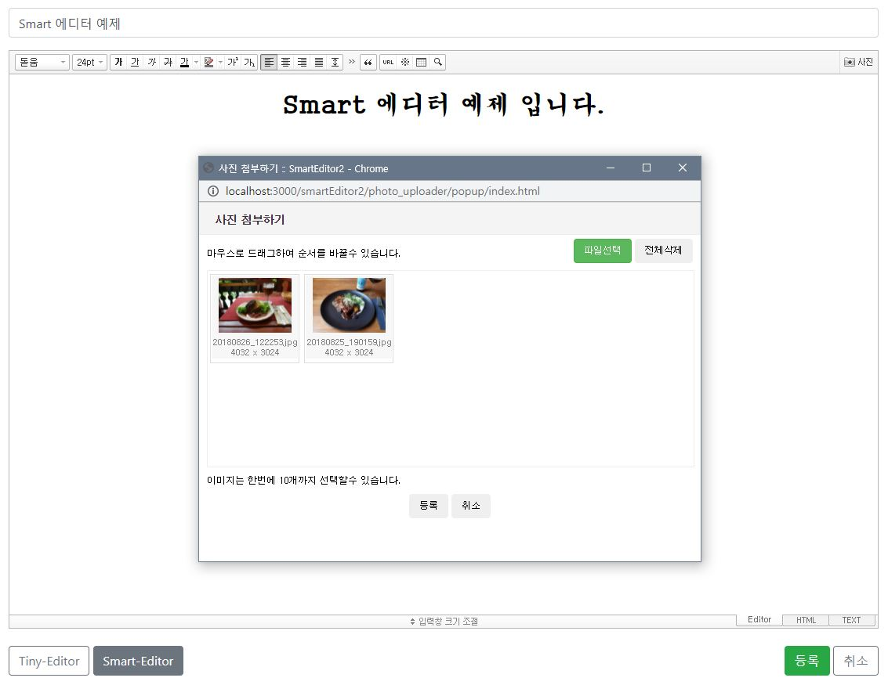
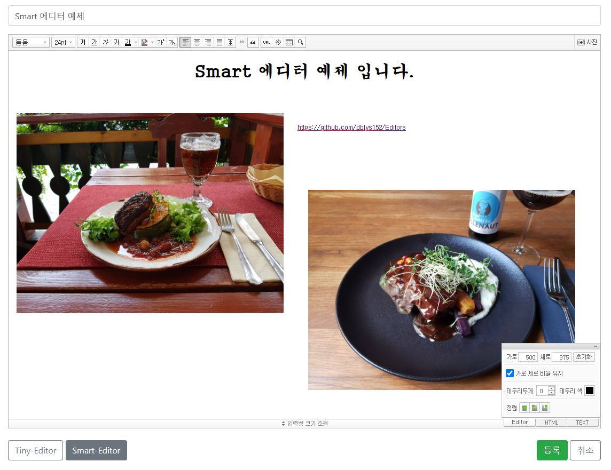

# Editors

### Tiny Editor, Smart Editor(네이버 스마트에디터) 예제입니다.
#### Server : Node.js + Express.js
#### View Engin : ejs
#### Editor Version : Tiny Editor (ver 4.9.2) / Smart Editor (ver 2.9)

## Tiny Editor 기능
- 에디터에 이미지 드래그 드롭 가능 (다중 O)
- 이미지 드래그 or 이미지 툴바에서 크기 조정 가능
- 입력창 자동 증가

## Smart Editor(네이버 스마트에디터) 기능
- 사진 툴바 팝업창에 이미지 드래그 드롭 가능 (다중 O)
- 이미지 클릭 후 우측 하단의 팝업창에서 크기 조정, 테두리, 정렬 가능
- 입력창 수동 조절

## 실행 전
#### 환경변수 .env 파일 설정 필요
- 파일명 : .env.development 
- 환경변수 : DB_HOST, DB_PORT, DB_USER, DB_PW, DB_NM

## 스크린샷

